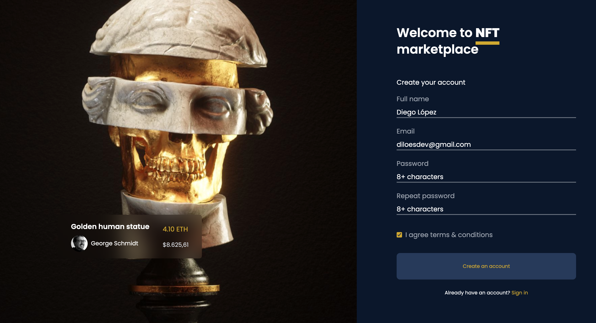

# Sobre el proyecto

Esta web emula un **formulario de registro** de un NFT Marketplace.
El diseño lo he sacado de Figma Community.
El objetivo de este proyecto es _poner en práctica mis conocimientos en las librerías React Hook Form y Yup para manejar formularios_.

## Tecnologías utilizadas

- NextJs
- TailwindCSS
- React Hook Form
- Yup

